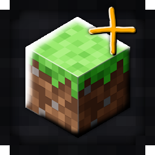

# Vanilla+ PvP

  **Vanilla‑Plus PvP is a refined fork of the original Vanilla‑Plus texture pack by xSpinHDx.**

  

---

Vanilla‑Plus PvP is a refined fork of the original Vanilla‑Plus texture pack by xSpinHDx, redesigned specifically for players who want a crisp, competitive edge in PvP without losing Minecraft’s iconic style.

This pack keeps the charm and readability of the original Vanilla‑Plus aesthetic, but reworks key textures to enhance clarity, visibility, and combat performance. Every change is made with PvP flow in mind—cleaner visuals, faster recognition, and smoother gameplay.

Showcase Link: https://youtu.be/D-msd0yJZ6U?si=U0kkhs2VVfNKZ3v9
